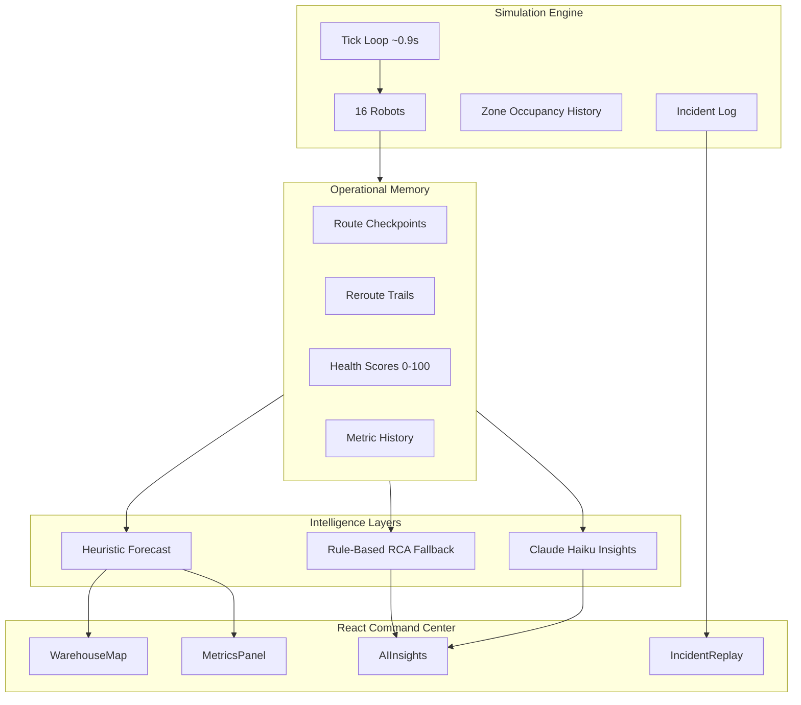

# FRIL — Fleet Reliability Intelligence Layer

**Operational intelligence for multi-vendor autonomous warehouse fleets.**

FRIL is a full-stack demonstration platform that simulates a heterogeneous robot fleet, surfaces live execution health on a spatial operations map, and layers heuristic + LLM reasoning on top of congestion memory, reliability scoring, and incident history. It is built to show how a shift supervisor would *see*, *replay*, *forecast*, and *act* on fleet risk—not just read raw metrics.

---

## What You Get

| Layer | Capability |
|--------|------------|
| **Live simulation** | 16 robots across 3 vendors and 6 warehouse zones, ~0.9s tick, in-memory FastAPI backend |
| **Spatial memory** | Per-robot route checkpoints, reroute trails, zone occupancy history with spike tinting |
| **Reliability scoring** | 0–100 health score per robot, `nominal` / `degraded` / `critical` tiers |
| **Incident replay** | Scrub timeline events; pulse + dim robots on the map during replay |
| **Predictive ops** | Heuristic congestion-escalation forecast (`nominal` / `elevated` / `critical`) with zone-level risk |
| **AI analysis** | Claude Haiku 4.5 root-cause reasoning with structured recovery guidance (optional API key) |
| **Operator controls** | Fleet reroute, zone pause, simulated congestion spike |

---

## Quick Start

### Prerequisites

- Python 3.10+
- Node.js 18+
- (Optional) `EMERGENT_LLM_KEY` for live AI insights

### 1. Backend

```bash
cd backend
pip install -r requirements.txt
```

Create `backend/.env`:

```env
EMERGENT_LLM_KEY=your_key_here          # optional — enables LLM insights; rule-based fallback without it
CORS_ORIGINS=http://localhost:3000      # optional — defaults to *
```

```bash
python -m uvicorn server:app --reload --host 0.0.0.0 --port 8000
```

API base: `http://localhost:8000/api`

### 2. Frontend

```bash
cd frontend
npm install
```

Create `frontend/.env` (optional):

```env
REACT_APP_BACKEND_URL=http://localhost:8000
```

```bash
npm start
```

Open **http://localhost:3000**

| Route | Description |
|-------|-------------|
| `/` | Product landing page |
| `/command-center` | Live operations dashboard |

### 3. Run tests

```bash
cd backend
pip install pytest httpx anyio
pytest tests/ -v
```

---

## Command Center Tour

The dashboard polls `/api/sim/state` every ~1.1s and composes four areas:

```
┌─────────────────────────────────────────────────────────────────────────┐
│  Operations Map          │  Incident Feed (live)                        │
│  · zones + robots        │  · severity-colored stream                   │
│  · replay focus          │  · replay launcher                         │
│  · forecast-risk zones   ├──────────────────────────────────────────────┤
│  · route overlays        │  Agent Inspector │ Replay │ Metrics / AI    │
└─────────────────────────────────────────────────────────────────────────┘
```

**Map interactions**

- Click a robot → open **Agent Inspector** (battery, task, reliability chart, event timeline)
- Click empty map → deselect
- **Esc** → close inspector or exit replay

**Incident replay**

- Click **replay** on an incident → sidebar becomes scrubber; related robot pulses (amber), others dim
- Timeline seeks update map focus via `replayEvent`

**Predictive panel** (Metrics)

- `operational_forecast.level`: `nominal` | `elevated` | `critical`
- Escalation probability + alerts driven by spike frequency, reroutes, queue instability, reliability drift
- Map zones with forecast risk show dashed borders and `FCST` badges

**AI Insights**

- Click **analyze** → POST `/api/sim/insights`
- Returns structured sections: **Root Cause Hypothesis**, **Operational Risk**, **Suggested Recovery Action**
- Falls back to rule-based inference if the LLM is unavailable

**Operator controls**

- Reroute all active units
- Pause a zone (8 ticks)
- Simulate congestion spike (6 ticks)

---

## Simulation Model

### Vendors (heterogeneous profiles)

| Vendor | Color | Traits |
|--------|-------|--------|
| **A** | Cyan | High speed · higher failure rate · higher ack lag |
| **B** | Emerald | Slower · lowest failure rate · best reliability |
| **C** | Amber | Balanced speed · moderate failure · moderate lag |

Fleet size: **6 + 5 + 5 = 16 robots**, each with callsign, battery, task queue, and event history.

### Zones

`Inbound` · `Outbound` · `Storage` · `Assembly` · `Inspection` · `Charging`

Zone occupancy is tracked per tick. Repeated density spikes (≥4 robots) tint zones amber/red and feed the predictive layer.

### Robot lifecycle

`idle` → `executing` → (`rerouting` / `retrying` on failure) → `charging` on low battery or charge-cycle task

Notable behaviors:

- Critical battery override (<10%) forces charge dispatch
- Congestion redistribution reroutes non-charging units
- Docking failures, ack timeouts, and stalled execution generate incidents + recovery actions
- Health score recalculates on task complete/fail with recency-weighted penalty

---

## Intelligence Architecture



### Reliability scoring

```
base = completed / (completed + failed) × 100
penalty = (recent_failures / recent_tasks) × 20
health_score = clamp(base − penalty, 0, 100)
```

Tiers: **critical** &lt;50 · **degraded** &lt;75 · **nominal** ≥75

The inspector renders a **Recharts** reliability history (derived from events or `reliability_history` when present).

### Predictive forecast (heuristic)

Signals combined into a 0–100 score:

- Zone spike frequency (recent window)
- Active reroute/retry count + live trails
- Throughput variance + rising congestion (queue instability)
- Count of degraded/critical health robots
- Operator congestion spike flag

Per-zone `zone_risks[]` powers map `FCST` highlighting.

### AI insights (optional LLM)

When `EMERGENT_LLM_KEY` is set, Claude Haiku 4.5 receives:

- Congestion history (current / peak / spikes)
- Vendor failure shares and reroute counts
- Lowest-health robots + reroute reasons
- Recent incident window

Response is parsed into `root_cause`, `operational_risk`, `recovery_action` with rule-based fallback on error.

---

## API Reference

All routes are prefixed with `/api`.

| Method | Endpoint | Description |
|--------|----------|-------------|
| `GET` | `/` | Service health |
| `GET` | `/sim/state` | Full snapshot: robots, zones, incidents, metrics, forecast, AI cache |
| `GET` | `/sim/incidents?limit=40` | Incident list |
| `GET` | `/sim/metrics` | Current metrics + history + forecast |
| `GET` | `/sim/robot/{robot_id}` | Single robot detail |
| `POST` | `/sim/insights` | Generate operational analysis `{ "horizon": 25 }` |
| `POST` | `/sim/reset` | Reset simulation |
| `POST` | `/sim/control/reroute-all` | Reroute executing/retrying units |
| `POST` | `/sim/control/pause-zone` | `{ "zone_id": "assembly", "duration_ticks": 8 }` |
| `POST` | `/sim/control/spike-congestion` | Force congestion spike |

### Key `sim/state` fields

```jsonc
{
  "tick": 142,
  "robots": [/* id, vendor, x, y, battery, health_score, reliability_tier, history, route_history, ... */],
  "incidents": [/* severity, kind, message, robot_id, zone, tick, ... */],
  "metrics": { "active", "charging", "congestion", "throughput", "recovery_rate", ... },
  "metric_history": [/* time series */],
  "zone_congestion_stats": [{ "id", "label", "current", "peak", "avg", "spikes" }],
  "operational_forecast": {
    "level": "elevated",
    "escalation_probability": 42.5,
    "alerts": ["..."],
    "zone_risks": [{ "id", "label", "level", "score" }],
    "signals": { "spike_frequency", "reroute_activity", "queue_instability", ... }
  },
  "ai_insights": [/* last 5 cached records */]
}
```

### Insights response shape

```jsonc
{
  "id": "a1b2c3d4",
  "generated_at": "14:32:01",
  "tick": 142,
  "insights": ["..."],           // legacy bullet list (still populated)
  "root_cause": "...",
  "operational_risk": "...",
  "recovery_action": "...",
  "snapshot": { /* metrics */ },
  "fallback": true               // present when LLM unavailable
}
```

---

## Project Structure

```
fril/
├── backend/
│   ├── server.py              # Simulation engine + FastAPI + intelligence helpers
│   ├── requirements.txt
│   ├── tests/
│   │   └── test_fril_backend.py
│   └── .env                   # EMERGENT_LLM_KEY, CORS_ORIGINS (gitignored)
├── frontend/
│   ├── public/
│   └── src/
│       ├── App.js             # Routes: /, /command-center
│       ├── lib/api.js         # Axios client
│       ├── components/
│       │   ├── WarehouseMap.jsx      # Map, zones, robots, replay + forecast UX
│       │   ├── AgentInspector.jsx    # Robot detail + ReliabilityChart
│       │   ├── ReliabilityChart.jsx  # Recharts reliability history
│       │   ├── IncidentFeed.jsx      # Live incident stream
│       │   ├── IncidentReplay.jsx    # Timeline scrubber
│       │   ├── MetricsPanel.jsx      # Metrics + predictive alerts
│       │   ├── AIInsights.jsx        # Root-cause analysis UI
│       │   ├── ControlPanel.jsx      # Operator actions
│       │   └── TopBar.jsx
│       ├── pages/
│       │   ├── Landing.jsx
│       │   └── CommandCenter.jsx
│       └── index.css          # Operational dark theme tokens
├── memory/                    # PRD + internal notes
└── README.md
```

---

## Tech Stack

| | |
|--|--|
| **Backend** | FastAPI · asyncio simulation loop · Pydantic · uvicorn |
| **Frontend** | React 19 · React Router 7 · Tailwind CSS 3 · Framer Motion · Recharts · Lucide |
| **AI** | Claude Haiku 4.5 via `emergentintegrations` (Emergent LLM key) |

---

## Configuration Reference

| Variable | Where | Default | Purpose |
|----------|-------|---------|---------|
| `EMERGENT_LLM_KEY` | `backend/.env` | — | Enables live LLM insights |
| `CORS_ORIGINS` | `backend/.env` | `*` | Comma-separated allowed origins |
| `REACT_APP_BACKEND_URL` | `frontend/.env` | `http://localhost:8000` | API host for `lib/api.js` |

> **Note:** `ControlPanel.jsx` uses `VITE_API_URL` for direct axios calls. For local dev, either set `VITE_API_URL=http://localhost:8000` in `frontend/.env` or rely on its built-in default.

---

## Design Notes

- **Dark operational UI** — base `#0B0F14`, panel borders `#243041`, accent cyan/emerald/amber/rose
- **No persistence** — simulation state is in-memory; restart backend or call `/sim/reset`
- **No auth** — demo / lab environment only
- **Polling model** — frontend pulls state; no WebSockets required

---

## Roadmap Ideas

- Persist session exports (incidents + metric history)
- WebSocket push for sub-second map updates
- Backend `reliability_history` time series per robot
- Playwright e2e for command-center flows

---

## License

Internal / demonstration project — BotSync FRIL v0.1.
