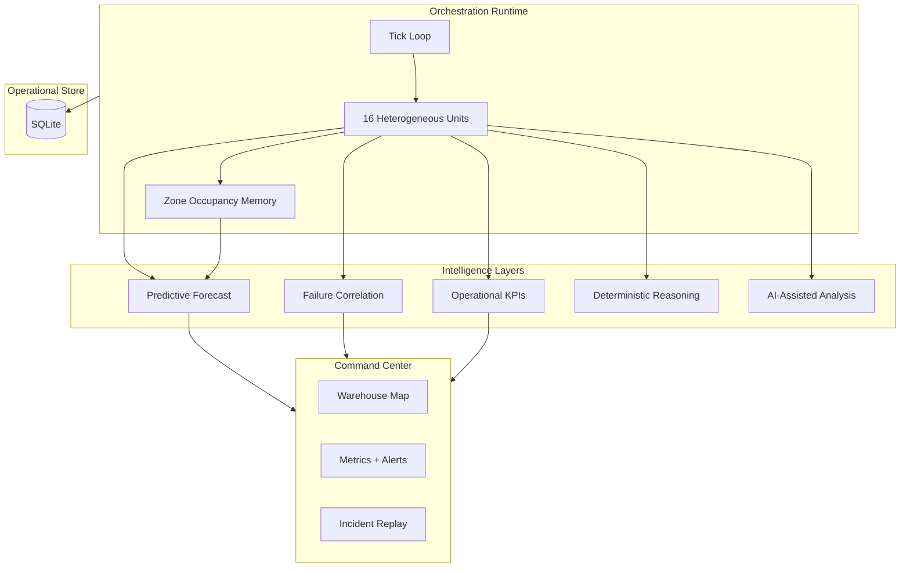

# FRIL — Fleet Reliability Intelligence Layer

Operational intelligence for multi-vendor autonomous warehouse fleets.

[Live Demo](https://botsync-fril.vercel.app/) • [Command Center](https://botsync-fril.vercel.app/command-center) • [Backend API](https://botsync.onrender.com) • [GitHub](https://github.com/Hemanth0508/Botsync)


---

## Live Demo

| Service        | URL                                                  |
| -------------- | ---------------------------------------------------- |
| Frontend       | https://botsync-fril.vercel.app/                     |
| Backend API    | https://botsync.onrender.com                         |
| Command Center | https://botsync-fril.vercel.app/command-center       |

> Simulation state resets periodically on hosted deployments.
> Best experienced on desktop at 1440p+ resolution.

**Deployed operational capabilities:** incident replay system · predictive operational forecasting · congestion memory · robot reliability intelligence · AI-assisted operational reasoning · multi-vendor orchestration

---

## Why This Exists

Modern autonomous warehouse fleets fail less from isolated robot faults and more from coordination breakdowns — congestion propagation, routing contention, battery recovery delays, and slow execution recovery cascading across zones.

Most operational dashboards expose telemetry. FRIL explores what an intelligence layer sitting *above* execution systems can do:

- Observe fleet behavior in real time across heterogeneous vendors
- Accumulate operational and spatial memory across ticks and sessions
- Identify degradation patterns before they escalate into failure cascades
- Surface predictive operational risk with zone-level attribution
- Support recovery orchestration through structured, actionable reasoning

The thesis is that **operational resilience is a systems design problem**, not a monitoring problem.

---

## Preview


---

## Core Operational Capabilities

| Layer | Capability |
| ----- | ---------- |
| **Fleet Observability** | 16 robots · 3 vendors · 6 zones · ~0.9s tick · FastAPI backend |
| **Spatial Memory** | Route checkpoints, reroute trails (time-faded), zone occupancy history |
| **Robot Reliability History** | 0–100 health score · `nominal` / `degraded` / `critical` tiers · per-unit history chart |
| **Incident Replay** | Timeline scrubber · severity heatmap · map focus pulse |
| **Predictive Forecasting** | Congestion-escalation forecast · `nominal` / `elevated` / `critical` with zone-level risk attribution |
| **Congestion Intelligence** | Vendor/zone attribution for reroute cascades · cascade density tracking |
| **Route Memory** | Reroute trail persistence, time-faded overlay on spatial map |
| **AI-Assisted Root Cause** | Structured LLM reasoning with deterministic fallback — same output schema regardless of path |
| **Operator Controls** | Fleet reroute · zone pause · synthetic congestion injection |
| **Operational Store** | SQLite persistence across process restarts for incidents, metrics, insight sessions |

---

## Demo Scenarios

These walkthroughs exercise the core operational intelligence capabilities:

**Congestion cascade across adjacent zones** — Inject a spike event and observe how saturation propagates to neighboring zones, triggering reroutes and queue instability.

**Reliability degradation from repeated reroutes** — Monitor vendor-level health scores as reroute pressure accumulates and reliability drift becomes measurable.

**Critical battery override recovery** — Watch the fleet runtime handle low-battery escalation: priority override, recovery latency, and post-recovery stability.

**Incident replay timeline scrubbing** — Select any incident from the stream, scrub through the replay, and observe the heatmap and spatial map reconstruct the failure sequence.

**Predictive congestion escalation** — Observe the forecast engine shift from `nominal` to `elevated` / `critical` as congestion signals compound across zones.

**Multi-vendor instability comparison** — Use the correlation panel to compare failure distribution and reroute behavior across Vendor A (high speed, higher fault rate), Vendor B (stable, slower), and Vendor C (balanced).

---

## Suggested Demo Flow (60–90 seconds)

1. Open the [Command Center](https://botsync-fril.vercel.app/command-center)
2. Trigger a congestion spike via Operator Controls
3. Observe the predictive escalation forecast update in real time
4. Click a robot to inspect reliability drift in the Agent Inspector
5. Run AI Operational Analysis and review root-cause output
6. Select an incident and scrub the replay timeline
7. Review MTTR, recovery latency, and the Fleet Stability Index in the KPIs panel

---

## System Design Focus

**Polling over WebSockets** — State is delivered via polling rather than WebSocket push. This prioritizes deterministic state snapshots and eliminates synchronization complexity during incident replay, where frame ordering and scrubber precision matter more than sub-second latency.

**Deterministic heuristics alongside LLM reasoning** — The AI reasoning path and the deterministic path produce identical output schemas: root cause hypothesis, operational risk, and recovery action. When the LLM path is unavailable, the deterministic layer operates from live signals — congestion history, vendor instability, battery stress, reroute behavior — without degradation in output structure.

**Lightweight persistence** — SQLite was chosen to make operational memory durable across process restarts without introducing infrastructure dependencies. Incident history, metrics, and insight sessions survive restarts locally. The design explicitly anticipates migration to an event-stream transport and shared time-series store for higher-frequency production deployments.

**Simulation clarity vs. production scale** — The runtime is calibrated for observability and reasoning demonstration, not throughput maximization. The architectural tradeoffs are visible and documented so the design can be extended toward production-scale deployments without structural rework.

---

## Operational Signals

FRIL tracks and correlates across ticks:

- Congestion persistence and zone saturation frequency
- Route instability and reroute cascade density
- Vendor-specific failure distribution
- Reliability degradation drift over time
- Recovery latency and MTTR
- Battery-risk escalation patterns
- Dispatch imbalance across zones

---

## Architecture



---

## Technical Implementation

### Stack

| | |
| -- | -- |
| **Backend** | FastAPI · asyncio orchestration loop · Pydantic · SQLite (`ops_store.py`) |
| **Frontend** | React 19 · React Router · Tailwind · Framer Motion · Recharts |
| **AI** | Claude Haiku 4.5 |

### Vendor Profiles

| Vendor | Characteristics |
| ------ | --------------- |
| **A** | High speed · higher failure rate · higher acknowledgment lag |
| **B** | Slower · lowest failure rate · strongest reliability profile |
| **C** | Balanced throughput and recovery |

### Reliability Formula

```
base = completed / (completed + failed) × 100
penalty = (recent_failures / recent_tasks) × 20
health_score = clamp(base − penalty, 0, 100)
```

### Predictive Forecast (Heuristic)

Combines spike frequency, reroute activity, queue instability (throughput variance + rising congestion), reliability drift, and fleet congestion level into `nominal` / `elevated` / `critical` with per-zone `zone_risks[]`.

### AI Reasoning Layer

Structured analysis returns:

- **Root Cause Hypothesis** — signal-correlated attribution to vendor, zone, or behavior pattern
- **Operational Risk** — severity and propagation likelihood
- **Suggested Recovery Action** — concrete operator directive

When the LLM path is unavailable, deterministic operational reasoning produces the same structure from live signals. Response includes `reasoning_mode`: `"llm"` | `"deterministic"`.

---

## Command Center Reference

| Interaction | Behavior |
| ----------- | --------- |
| Click robot | Agent Inspector — battery, reliability chart, event timeline |
| Click incident **Replay** | Scrubber + map pulse/dim + severity heatmap |
| **Analyze** (AI panel) | Root-cause operational intelligence |
| Operator Controls | Reroute all · pause zone · inject congestion event |
| **Esc** | Close inspector or exit replay |

**Map cues:** zone spike tinting · `FCST` forecast-risk badges · critical congestion pulse · fading reroute trails

---

## API Reference

Base path: `/api`

| Method | Endpoint | Description |
| ------ | -------- | ----------- |
| `GET` | `/sim/state` | Full snapshot + forecast + KPIs + correlation |
| `GET` | `/sim/metrics` | Metrics history + intelligence fields |
| `GET` | `/sim/incidents` | Incident stream |
| `GET` | `/sim/robot/{id}` | Unit detail |
| `POST` | `/sim/insights` | Generate operational analysis |
| `POST` | `/sim/reset` | Reset runtime + clear operational store |
| `POST` | `/sim/control/reroute-all` | Fleet reroute |
| `POST` | `/sim/control/pause-zone` | Zone hold |
| `POST` | `/sim/control/spike-congestion` | Synthetic congestion event |

### Response Extensions (Non-Breaking)

```jsonc
"operational_forecast": {
  "level", "escalation_probability", "alerts", "zone_risks", "signals"
},
"operational_kpis": {
  "mttr_ticks", "recovery_latency_s", "congestion_persistence", "fleet_stability_index"
},
"failure_correlation": {
  "narratives", "by_vendor", "by_zone", "cascade_count"
}
```

---

## Setup

### Prerequisites

- Python 3.10+
- Node.js 18+

### Backend

```bash
cd backend
pip install -r requirements.txt
```

`backend/.env`:

```env
ANTHROPIC_API_KEY=your_key_here
CORS_ORIGINS=http://localhost:3000
```

> `EMERGENT_LLM_KEY` is still accepted for backward compatibility.

```bash
python -m uvicorn server:app --reload --host 0.0.0.0 --port 8000
```

Operational memory is written to `backend/data/fril_ops.db` (gitignored).

### Frontend

```bash
cd frontend
npm install
```

`frontend/.env`:

```env
REACT_APP_BACKEND_URL=http://localhost:8000
VITE_API_URL=http://localhost:8000
```

```bash
npm start
```

| Route | Description |
| ----- | ----------- |
| `/` | Product landing |
| `/command-center` | Live operations dashboard |

### Tests

```bash
cd backend
pip install pytest httpx anyio
pytest tests/ -v
```

---

## Project Structure

```
fril/
├── backend/
│   ├── server.py           # Orchestration engine + API + intelligence
│   ├── ops_store.py        # SQLite operational memory
│   ├── data/               # Local ops DB (generated)
│   └── tests/
├── frontend/src/
│   ├── components/
│   │   ├── WarehouseMap.jsx
│   │   ├── MetricsPanel.jsx
│   │   ├── AgentInspector.jsx
│   │   ├── ReliabilityChart.jsx
│   │   ├── IncidentReplay.jsx
│   │   ├── AIInsights.jsx
│   │   └── ControlPanel.jsx
│   └── pages/
│       ├── Landing.jsx
│       └── CommandCenter.jsx
└── memory/assets/           # Preview screenshots
```

---

## Configuration

| Variable | Location | Purpose |
| -------- | -------- | ------- |
| `ANTHROPIC_API_KEY` | `backend/.env` | AI-assisted insights |
| `CORS_ORIGINS` | `backend/.env` | Allowed frontend origins |
| `REACT_APP_BACKEND_URL` | `frontend/.env` | API host (`lib/api.js`) |
| `VITE_API_URL` | `frontend/.env` | API host (operator controls) |

---

## Future Extensions

- WebSocket event streaming for sub-second state propagation
- RL-based routing optimization using accumulated congestion memory
- Real warehouse telemetry ingestion via vendor adapter layer
- Multi-site orchestration with cross-site incident correlation
- Time-series analytics backend (InfluxDB / TimescaleDB)
- Failure prediction models trained on operational signal history

---

## License

BotSync FRIL · operational intelligence layer · v0.1