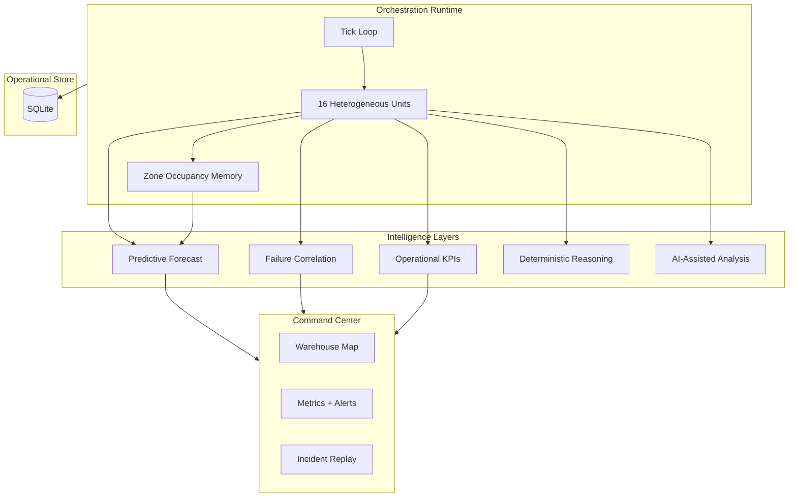

# FRIL — Fleet Reliability Intelligence Layer

**Operational intelligence for multi-vendor autonomous warehouse fleets.**

Designed to explore how warehouse operators can move from reactive monitoring toward **predictive operational resilience**.

FRIL orchestrates a heterogeneous robot fleet runtime with synthetic operational events, surfaces live execution health on a spatial operations map, and layers deterministic + AI-assisted reasoning on congestion memory, reliability scoring, and incident history. Shift supervisors can *see*, *replay*, *forecast*, and *act* on fleet risk—not only read telemetry.

---

## Why This Exists

Modern warehouse fleets increasingly operate across heterogeneous robot vendors, each with different routing behavior, reliability profiles, and recovery characteristics.

Most operational dashboards expose telemetry.

**FRIL focuses on operational reasoning:**

- Identifying instability before failure cascades
- Surfacing congestion memory spatially
- Correlating reroutes with reliability degradation
- Accelerating operator recovery decisions

FRIL models how localized congestion propagates into **reroute cascades**, queue instability, and reliability degradation across adjacent operational zones.

The goal is not visualization alone, but **operational resilience visibility**.

---

## Preview

> Add screenshots or GIFs under `memory/assets/` (see `memory/assets/README.md`).


---

## Core Capabilities

| Layer | Capability |
|--------|------------|
| **Orchestration runtime** | 16 robots · 3 vendors · 6 zones · ~0.9s tick · FastAPI backend |
| **Spatial memory** | Route checkpoints, reroute trails (time-faded), zone occupancy history |
| **Reliability scoring** | 0–100 health · `nominal` / `degraded` / `critical` tiers · history chart |
| **Incident replay** | Timeline scrubber · severity heatmap · map focus pulse |
| **Predictive ops** | Congestion-escalation forecast · `nominal` / `elevated` / `critical` |
| **Failure correlation** | Vendor/zone attribution for reroute cascades |
| **Operational KPIs** | MTTR · recovery latency · congestion persistence · fleet stability index |
| **AI reasoning** | AI-assisted root-cause analysis with structured recovery recommendations |
| **Operator controls** | Fleet reroute · zone pause · synthetic congestion event |
| **Operational store** | SQLite persistence for incidents, metrics, and insight sessions |

---

## Operational Signals Modeled

FRIL tracks and correlates:

- Congestion persistence
- Route instability
- Vendor-specific failure distribution
- Reliability degradation drift
- Recovery latency
- Battery-risk escalation
- Zone saturation frequency
- Dispatch imbalance
- Reroute cascade density

---

## Architecture



### Architectural tradeoffs

The platform currently uses **polling** instead of WebSockets to prioritize deterministic state snapshots and reduce synchronization complexity during replay operations.

Operational memory is persisted locally via SQLite so incident and metric history survive process restarts. This can later transition to event-stream transport and a shared time-series store for higher-frequency production deployments.

### AI reasoning layer

Structured analysis returns:

- **Root Cause Hypothesis**
- **Operational Risk**
- **Suggested Recovery Action**

When the LLM path is unavailable, **deterministic operational reasoning** produces the same structure from live signals (congestion history, vendor instability, battery stress, reroute behavior).

Model implementation: Claude Haiku 4.5 via the Emergent integrations SDK (see Technical Implementation).

---

## Command Center Walkthrough

| Interaction | Behavior |
|-------------|----------|
| Click robot | Agent Inspector — battery, reliability chart, event timeline |
| Click incident **replay** | Scrubber + map pulse/dim + severity heatmap |
| **Analyze** (AI panel) | Root-cause operational intelligence |
| Operator controls | Reroute all · pause zone · inject congestion event |
| **Esc** | Close inspector or exit replay |

**Map cues:** zone spike tinting · `FCST` forecast-risk badges · critical-level congestion pulse · fading reroute trails

---

## Technical Implementation

### Stack

| | |
|--|--|
| **Backend** | FastAPI · asyncio orchestration loop · Pydantic · SQLite (`ops_store.py`) |
| **Frontend** | React 19 · React Router · Tailwind · Framer Motion · Recharts |
| **AI** | Claude Haiku 4.5 (`emergentintegrations`) |

### Vendor profiles

| Vendor | Traits |
|--------|--------|
| **A** | High speed · higher failure rate · higher ack lag |
| **B** | Slower · lowest failure rate · strongest reliability |
| **C** | Balanced throughput and recovery |

### Reliability formula

```
base = completed / (completed + failed) × 100
penalty = (recent_failures / recent_tasks) × 20
health_score = clamp(base − penalty, 0, 100)
```

### Predictive forecast (heuristic)

Combines spike frequency, reroute activity, queue instability (throughput variance + rising congestion), reliability drift, and fleet congestion level into `nominal` / `elevated` / `critical` with per-zone `zone_risks[]`.

---

## API Reference

Base path: `/api`

| Method | Endpoint | Description |
|--------|----------|-------------|
| `GET` | `/sim/state` | Full snapshot + forecast + KPIs + correlation |
| `GET` | `/sim/metrics` | Metrics history + intelligence fields |
| `GET` | `/sim/incidents` | Incident stream |
| `GET` | `/sim/robot/{id}` | Unit detail |
| `POST` | `/sim/insights` | Generate operational analysis |
| `POST` | `/sim/reset` | Reset runtime + clear operational store |
| `POST` | `/sim/control/reroute-all` | Fleet reroute |
| `POST` | `/sim/control/pause-zone` | Zone hold |
| `POST` | `/sim/control/spike-congestion` | Synthetic congestion event |

### Added fields (non-breaking)

```jsonc
"operational_forecast": { "level", "escalation_probability", "alerts", "zone_risks", "signals" },
"operational_kpis": { "mttr_ticks", "recovery_latency_s", "congestion_persistence", "fleet_stability_index" },
"failure_correlation": { "narratives", "by_vendor", "by_zone", "cascade_count" }
```

Insights response also includes `reasoning_mode`: `"llm"` | `"deterministic"`.

---

## Setup

### Prerequisites

- Python 3.10+
- Node.js 18+

### Backend

```bash
cd backend
pip install -r requirements.txt
```

`backend/.env`:

```env
ANTHROPIC_API_KEY=your_key_here
CORS_ORIGINS=http://localhost:3000
```

> `EMERGENT_LLM_KEY` is still accepted for backward compatibility.

```bash
python -m uvicorn server:app --reload --host 0.0.0.0 --port 8000
```

Operational memory is written to `backend/data/fril_ops.db` (gitignored).

### Frontend

```bash
cd frontend
npm install
```

`frontend/.env`:

```env
REACT_APP_BACKEND_URL=http://localhost:8000
VITE_API_URL=http://localhost:8000
```

```bash
npm start
```

| Route | Description |
|-------|-------------|
| `/` | Product landing |
| `/command-center` | Live operations dashboard |

### Tests

```bash
cd backend
pip install pytest httpx anyio
pytest tests/ -v
```

---

## Project Structure

```
fril/
├── backend/
│   ├── server.py           # Orchestration engine + API + intelligence
│   ├── ops_store.py        # SQLite operational memory
│   ├── data/               # Local ops DB (generated)
│   └── tests/
├── frontend/src/
│   ├── components/
│   │   ├── WarehouseMap.jsx
│   │   ├── MetricsPanel.jsx
│   │   ├── AgentInspector.jsx
│   │   ├── ReliabilityChart.jsx
│   │   ├── IncidentReplay.jsx
│   │   ├── AIInsights.jsx
│   │   └── ControlPanel.jsx
│   └── pages/
│       ├── Landing.jsx
│       └── CommandCenter.jsx
└── memory/assets/           # Preview screenshots (optional)
```

---

## Configuration

| Variable | Location | Purpose |
|----------|----------|---------|
| `ANTHROPIC_API_KEY` | `backend/.env` | AI-assisted insights |
| `CORS_ORIGINS` | `backend/.env` | Allowed frontend origins |
| `REACT_APP_BACKEND_URL` | `frontend/.env` | API host (`lib/api.js`) |
| `VITE_API_URL` | `frontend/.env` | API host (operator controls) |

---

## License

BotSync FRIL · operational intelligence layer · v0.1
